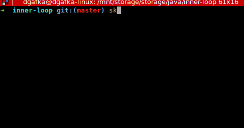
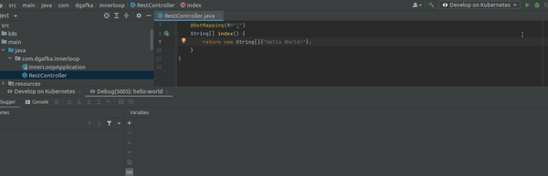

# Full Inner Loop Developing Spring Boot Application on Kubernetes Cluster
This is based on [great presentation](https://www.youtube.com/watch?v=akSskYvcmFo&ab_channel=SpringDeveloper) from [Dave Syer](https://twitter.com/david_syer) on [SpringOne conference](https://springone.io/)

You will be able to run your Spring Application on local Kubernetes Cluster.   
After making changes, it will automatically reload the application inside the container based on spring devtools.  
You will be able to debug the application directly from your IDE.

1. Install [ctlptl](https://github.com/tilt-dev/ctlptl) to set up Local Kubernetes Cluster with Docker Registry
2. Create Cluster and Registry ctlptl 

    create registry ctlptl-registry --port=5000 \
    && ctlptl create cluster kind --registry=ctlptl-registry
3. Install [skaffold](https://skaffold.dev/) for managing cluster
4. Run Spring Boot Application in your cluster

    skaffold dev --port-forward

### If you want to debug application from your IDE

5. Install [Cloud Code Plugin](https://cloud.google.com/code/docs). Google Cloud solution for running skaffold from IDE
6. Run the application from IDE using debugger